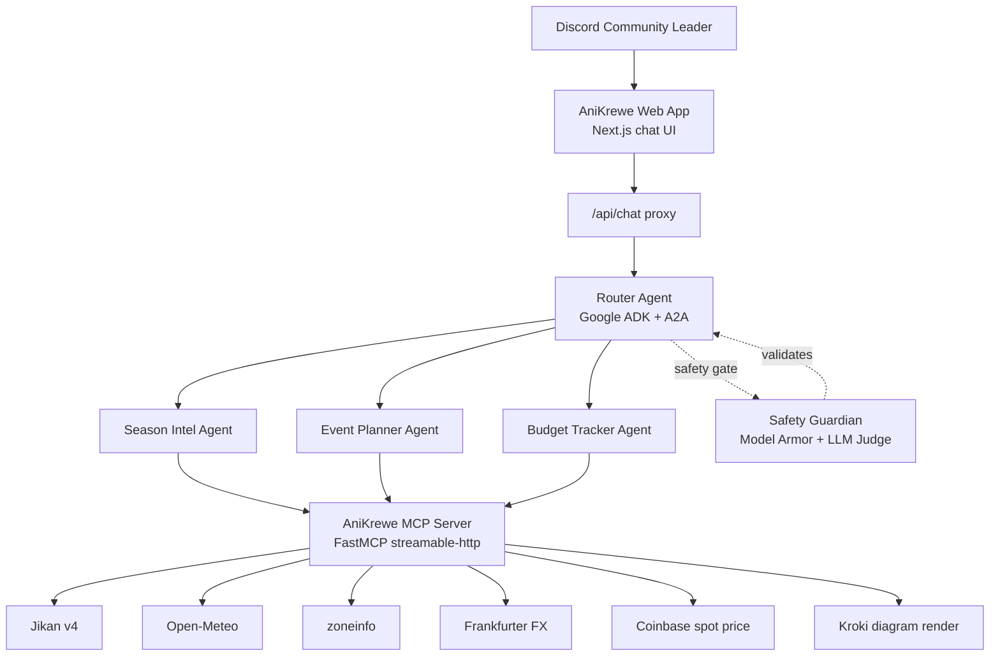

# AniKrewe

An anime community operations hub for Malaysian Discord communities — built for **Track C - Operations Hub (Process Automation Swarm)** of the Gemini Nexus 2026 hackathon.

AniKrewe automates scheduling, budgeting, and event planning using an AI agent swarm powered by Google ADK, Gemini 2.5 Flash, and the A2A protocol.

## Functional Diagram



## A2A Architecture

```
Frontend (Next.js, :3000)
    ↓ A2A JSON-RPC
A2A Server (ADK agents, :10000)
    ↓ MCP streamable-http
MCP Server (FastMCP, :8080)
```

## Agent Profiles

| Agent | Responsibility | Tools / Capability |
| ----- | -------------- | ------------------ |
| Router Agent | Classifies the request, delegates to specialists, and asks clarifying questions when the request is ambiguous | `AgentTool` delegation over A2A |
| Season Intel | Seasonal anime discovery, airing lookup, and schedule filtering | Jikan v4 anime tools |
| Event Planner | Group watch coordination, timezone handling, and weather-aware meetup planning | Time and weather tools |
| Budget Tracker | Currency conversion, cost splitting, and crypto spot checks | FX and crypto tools |
| Safety Guardian | Blocks off-scope or unsafe inputs and outputs before they reach the user | Model Armor plus Gemini judge |

**Safety:** Dual-layer guardrails via GCP Model Armor + LLM-as-a-Judge plugin.

## Judging Alignment

- **Agentic Agency and Recovery (40%)**: the router delegates work to specialists, specialists have domain-scoped tool access, and the UI surfaces thinking traces so recovery is visible during the demo.
- **Technical Depth (30%)**: the stack combines Google ADK, A2A transport, FastMCP, streamable HTTP MCP, and live external APIs in one end-to-end swarm.
- **System Robustness (20%)**: guardrails run before and after model calls, external requests use structured error payloads, and the frontend proxy supports long-running multi-hop requests.
- **Docs and Demo (10%)**: this README now includes the functional flow, agent profiles, deployment URLs, and setup steps judges need to evaluate the project quickly.

## Tech Stack

| Layer           | Technology                              |
| --------------- | --------------------------------------- |
| Agent Framework | Google ADK 1.13.0                       |
| MCP Server      | FastMCP 2.11.3                          |
| A2A Protocol    | a2a-sdk 0.3.3                           |
| LLM             | Gemini 2.5 Flash (Vertex AI)            |
| Guardrails      | GCP Model Armor + LLM-as-a-Judge        |
| Frontend        | Next.js 15 + Tailwind CSS 4 + shadcn/ui |
| Deployment      | Google Cloud Run                        |
| Package Manager | uv (Python), pnpm (frontend)            |

## Local Development

You need three terminals running simultaneously.

**Prerequisites:** Python 3.12+, [uv](https://docs.astral.sh/uv/), Node.js 20+, [pnpm](https://pnpm.io/), a `.env` file (copy from `.env.example`).

```bash
# Terminal 1 — MCP Server (port 8080)
uv sync
uv run python tools/server.py

# Terminal 2 — A2A Agents (port 10000)
uv run python agents/root_agent/agent.py

# Terminal 3 — Frontend (port 3000)
cd app && pnpm install && pnpm dev
```

Open `http://localhost:3000` and start chatting.

## Deployment (Google Cloud Run)

All services are deployed to `us-central1` in the `gemini-nexus-hackathon` GCP project.

### Deployed URLs

| Service    | URL                                                      |
| ---------- | -------------------------------------------------------- |
| Frontend   | https://anikrewe-app-438706399773.us-central1.run.app    |
| A2A Agents | https://anikrewe-agents-438706399773.us-central1.run.app |
| MCP Server | https://anikrewe-tools-bjqqkq5rpa-uc.a.run.app           |

### Full Deploy (all 3 services)

Run from the **project root** (`gemini-nexus-hackathon/`).

#### Step 1 — Build Docker images

```bash
# Build all 3 images (can run in parallel)
gcloud builds submit --config deploy/cloudbuild-tools.yaml --region us-central1
gcloud builds submit --config deploy/cloudbuild-agents.yaml --region us-central1
gcloud builds submit --config deploy/cloudbuild-app.yaml --region us-central1
```

#### Step 2 — Deploy MCP Server (first, other services depend on its URL)

```bash
gcloud run deploy anikrewe-tools \
  --image us-central1-docker.pkg.dev/gemini-nexus-hackathon/cloud-run-source-deploy/anikrewe-tools \
  --region us-central1 \
  --allow-unauthenticated \
  --set-env-vars "GOOGLE_CLOUD_PROJECT=gemini-nexus-hackathon"
```

Note the **Service URL** from the output — you'll need it for the next step.

#### Step 3 — Deploy A2A Agents

Replace `<TOOLS_URL>` with the MCP server URL from Step 2.

```bash
gcloud run deploy anikrewe-agents \
  --image us-central1-docker.pkg.dev/gemini-nexus-hackathon/cloud-run-source-deploy/anikrewe-agents \
  --region us-central1 \
  --allow-unauthenticated \
  --memory 1Gi \
  --timeout 300 \
  --set-env-vars "GOOGLE_GENAI_USE_VERTEXAI=TRUE,GOOGLE_CLOUD_PROJECT=gemini-nexus-hackathon,GOOGLE_CLOUD_LOCATION=asia-southeast1,MCP_SERVER_URL=<TOOLS_URL>/mcp,A2A_PORT=10000,ADK_INCLUDE_THOUGHTS=true,ENABLE_MODEL_ARMOR=true,MODEL_ARMOR_TEMPLATE_ID=anikrewe-safety,MODEL_ARMOR_LOCATION=us-central1"
```

Note the **Service URL** from the output.

#### Step 4 — Deploy Frontend

Replace `<AGENTS_URL>` with the A2A agents URL from Step 3.

```bash
gcloud run deploy anikrewe-app \
  --image us-central1-docker.pkg.dev/gemini-nexus-hackathon/cloud-run-source-deploy/anikrewe-app \
  --region us-central1 \
  --allow-unauthenticated \
  --set-env-vars "A2A_SERVER_URL=<AGENTS_URL>"
```

### Redeploy Frontend Only (after UI changes)

This is the most common case — when someone updates the frontend code and you just need to push the new version.

```bash
# 1. Rebuild the frontend image
gcloud builds submit --config deploy/cloudbuild-app.yaml --region us-central1

# 2. Redeploy (uses existing env vars)
gcloud run deploy anikrewe-app \
  --image us-central1-docker.pkg.dev/gemini-nexus-hackathon/cloud-run-source-deploy/anikrewe-app \
  --region us-central1
```

### Redeploy Agents Only (after agent logic changes)

```bash
# 1. Rebuild the agents image
gcloud builds submit --config deploy/cloudbuild-agents.yaml --region us-central1

# 2. Redeploy (uses existing env vars)
gcloud run deploy anikrewe-agents \
  --image us-central1-docker.pkg.dev/gemini-nexus-hackathon/cloud-run-source-deploy/anikrewe-agents \
  --region us-central1
```

### Health Checks

```bash
# Check if services are running
gcloud run services list --region us-central1 --filter "anikrewe"

# Check MCP server
curl -s https://anikrewe-tools-bjqqkq5rpa-uc.a.run.app/mcp | head -c 200

# Check A2A agents
curl -s https://anikrewe-agents-438706399773.us-central1.run.app/.well-known/agent.json
```

### Cleanup (delete all services)

Only run this if you want to completely tear down the deployment.

```bash
gcloud run services delete anikrewe-app --region us-central1 --quiet
gcloud run services delete anikrewe-agents --region us-central1 --quiet
gcloud run services delete anikrewe-tools --region us-central1 --quiet
```

## Cost

Cloud Run **scales to zero** — you pay nothing when no one is using it. The main cost driver is **Vertex AI inference** when someone sends a chat message (~$0.001–0.01 per query). It's safe to leave services running for weeks during judging.

## Environment Variables

Copy `.env.example` to `.env` and fill in your GCP project ID. See the file for all available options.

## Repository Structure

This submission includes the required top-level folders and manifest expected by the hackathon:

- `agents/` — ADK swarm logic, prompts, safety plugins, and tests
- `tools/` — FastMCP tool server and integration tests
- `app/` — Next.js frontend and A2A proxy
- `requirements.txt` — Python dependency manifest for submission review

## License

Hackathon project — Gemini Nexus 2026.
