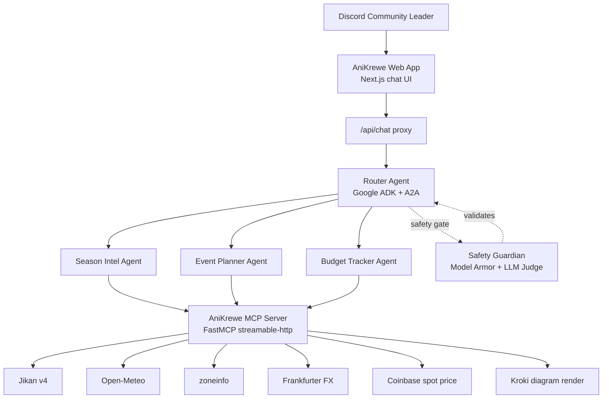

# AniKrewe

An anime community operations hub for Malaysian Discord communities — built for **Track C - Operations Hub (Process Automation Swarm)** of the Gemini Nexus 2026 hackathon.

AniKrewe automates scheduling, budgeting, and event planning using an AI agent swarm powered by Google ADK, Gemini 2.5 Flash, and the A2A protocol.

## Functional Diagram



## Agent Profiles

| Agent           | Responsibility                                                                                                | Tools / Capability              |
| --------------- | ------------------------------------------------------------------------------------------------------------- | ------------------------------- |
| Router Agent    | Classifies the request, delegates to specialists, and asks clarifying questions when the request is ambiguous | `AgentTool` delegation over A2A |
| Season Intel    | Seasonal anime discovery, airing lookup, and schedule filtering                                               | Jikan v4 anime tools            |
| Event Planner   | Group watch coordination, timezone handling, and weather-aware meetup planning                                | Time and weather tools          |
| Budget Tracker  | Currency conversion, cost splitting, and crypto spot checks                                                   | FX and crypto tools             |
| Safety Guardian | Blocks off-scope or unsafe inputs and outputs before they reach the user                                      | Model Armor plus Gemini judge   |

## Judging Alignment

- **Agentic Agency and Recovery (40%)**: the router delegates work to specialists, specialists have domain-scoped tool access, and the UI surfaces thinking traces so recovery is visible during the demo.
- **Technical Depth (30%)**: the stack combines Google ADK, A2A transport, FastMCP, streamable HTTP MCP, and live external APIs in one end-to-end swarm.
- **System Robustness (20%)**: guardrails run before and after model calls, external requests use structured error payloads, and the frontend proxy supports long-running multi-hop requests.
- **Docs and Demo (10%)**: this README includes the functional flow, agent profiles, deployment URLs, and setup steps judges need to evaluate the project quickly.

## Tech Stack

| Layer           | Technology                              |
| --------------- | --------------------------------------- |
| Agent Framework | Google ADK 1.13.0                       |
| MCP Server      | FastMCP 2.11.3                          |
| A2A Protocol    | a2a-sdk 0.3.3                           |
| LLM             | Gemini 2.5 Flash (Vertex AI)            |
| Guardrails      | GCP Model Armor + LLM-as-a-Judge        |
| Frontend        | Next.js 15 + Tailwind CSS 4 + shadcn/ui |
| Deployment      | Google Cloud Run                        |
| Package Manager | uv (Python), pnpm (frontend)            |

## Repository Structure

- `agents/` — ADK swarm logic, prompts, safety plugins, and tests
- `tools/` — FastMCP tool server and integration tests
- `app/` — Next.js frontend and A2A proxy
- `deploy/` — Dockerfiles and Cloud Build configs
- `requirements.txt` — Python dependency manifest for submission review

---

## Getting Started

### Prerequisites

- Python 3.12+, [uv](https://docs.astral.sh/uv/)
- Node.js 20+, [pnpm](https://pnpm.io/)
- [Google Cloud CLI](https://cloud.google.com/sdk/docs/install) (for deployment)
- A `.env` file at the project root (copy from `.env.example` and fill in your GCP project ID)

### Run Locally

Open three terminals and run one command in each:

```bash
# Terminal 1 — MCP Server (port 8080)
uv sync
uv run python tools/server.py

# Terminal 2 — A2A Agents (port 10000)
uv run python agents/root_agent/agent.py

# Terminal 3 — Frontend (port 3000)
cd app && pnpm install && pnpm dev
```

Then open http://localhost:3000.

---

## Deployment

All three services run on **Google Cloud Run** in `us-central1`. Cloud Run scales to zero so there is no cost when idle — you only pay for Vertex AI inference when someone sends a message.

### Live URLs

| Service    | URL                                                      |
| ---------- | -------------------------------------------------------- |
| Frontend   | https://anikrewe-app-438706399773.us-central1.run.app    |
| A2A Agents | https://anikrewe-agents-438706399773.us-central1.run.app |
| MCP Server | https://anikrewe-tools-bjqqkq5rpa-uc.a.run.app           |

### How Deployment Works

Every deploy is two steps: **build** the Docker image, then **deploy** it to Cloud Run.

```
code change  →  gcloud builds submit (build image)  →  gcloud run deploy (push to Cloud Run)
```

The three services must be deployed in order because each one depends on the URL of the previous:

```
MCP Server (no dependencies)  →  A2A Agents (needs MCP URL)  →  Frontend (needs A2A URL)
```

Once deployed, env vars are saved — you only need to pass them on the first deploy.

### Deploy Everything From Scratch

Run all commands from the project root.

**1. Build all three images** (you can run these in separate terminals to speed it up):

```bash
gcloud builds submit --config deploy/cloudbuild-tools.yaml --region us-central1
gcloud builds submit --config deploy/cloudbuild-agents.yaml --region us-central1
gcloud builds submit --config deploy/cloudbuild-app.yaml --region us-central1
```

**2. Deploy the MCP Server:**

```bash
gcloud run deploy anikrewe-tools \
  --image us-central1-docker.pkg.dev/gemini-nexus-hackathon/cloud-run-source-deploy/anikrewe-tools \
  --region us-central1 \
  --allow-unauthenticated \
  --set-env-vars "GOOGLE_CLOUD_PROJECT=gemini-nexus-hackathon"
```

Copy the **Service URL** printed at the end (e.g. `https://anikrewe-tools-xxx.run.app`).

**3. Deploy the A2A Agents** — paste the MCP URL where it says `<TOOLS_URL>`:

```bash
gcloud run deploy anikrewe-agents \
  --image us-central1-docker.pkg.dev/gemini-nexus-hackathon/cloud-run-source-deploy/anikrewe-agents \
  --region us-central1 \
  --allow-unauthenticated \
  --memory 1Gi \
  --timeout 300 \
  --set-env-vars "\
GOOGLE_GENAI_USE_VERTEXAI=TRUE,\
GOOGLE_CLOUD_PROJECT=gemini-nexus-hackathon,\
GOOGLE_CLOUD_LOCATION=asia-southeast1,\
MCP_SERVER_URL=<TOOLS_URL>/mcp,\
A2A_PORT=10000,\
ADK_INCLUDE_THOUGHTS=true,\
ENABLE_MODEL_ARMOR=true,\
MODEL_ARMOR_TEMPLATE_ID=anikrewe-safety,\
MODEL_ARMOR_LOCATION=us-central1"
```

Copy the **Service URL** printed at the end.

**4. Deploy the Frontend** — paste the A2A URL where it says `<AGENTS_URL>`:

```bash
gcloud run deploy anikrewe-app \
  --image us-central1-docker.pkg.dev/gemini-nexus-hackathon/cloud-run-source-deploy/anikrewe-app \
  --region us-central1 \
  --allow-unauthenticated \
  --set-env-vars "A2A_SERVER_URL=<AGENTS_URL>"
```

### Redeploy After Code Changes

After the first deploy, you only need to rebuild and redeploy the service you changed. Env vars carry over automatically.

**Frontend only** (most common — after UI changes in `app/`):

```bash
gcloud builds submit --config deploy/cloudbuild-app.yaml --region us-central1
gcloud run deploy anikrewe-app \
  --image us-central1-docker.pkg.dev/gemini-nexus-hackathon/cloud-run-source-deploy/anikrewe-app \
  --region us-central1
```

**Agents only** (after changes in `agents/`):

```bash
gcloud builds submit --config deploy/cloudbuild-agents.yaml --region us-central1
gcloud run deploy anikrewe-agents \
  --image us-central1-docker.pkg.dev/gemini-nexus-hackathon/cloud-run-source-deploy/anikrewe-agents \
  --region us-central1
```

**MCP tools only** (after changes in `tools/`):

```bash
gcloud builds submit --config deploy/cloudbuild-tools.yaml --region us-central1
gcloud run deploy anikrewe-tools \
  --image us-central1-docker.pkg.dev/gemini-nexus-hackathon/cloud-run-source-deploy/anikrewe-tools \
  --region us-central1
```

### Verify Services Are Running

```bash
gcloud run services list --region us-central1 --filter "anikrewe"
```

### Tear Down (delete everything)

```bash
gcloud run services delete anikrewe-app --region us-central1 --quiet
gcloud run services delete anikrewe-agents --region us-central1 --quiet
gcloud run services delete anikrewe-tools --region us-central1 --quiet
```

---

## License

© Hee Zi Jie — AniKrewe — Gemini Nexus 2026
