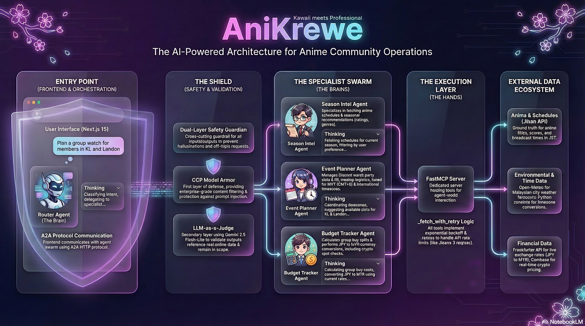
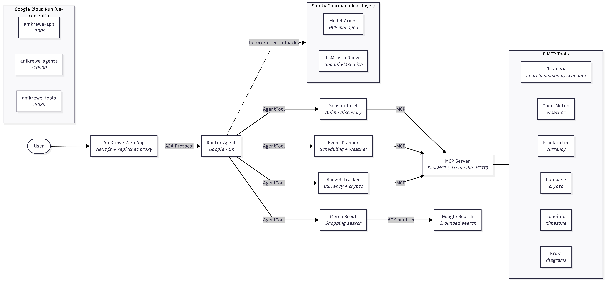

# AniKrewe

AniKrewe is an AI operations hub for Malaysian anime communities, built for **Track C - Operations Hub (Process Automation Swarm)** of the Gemini Nexus 2026 hackathon.

It helps community leaders answer practical operational questions in one place:

- What anime is worth watching this season
- When a group watch should happen across time zones
- How much a group buy costs in MYR
- Whether a meetup plan is safe given the weather

Instead of acting like a generic chatbot, AniKrewe behaves like an operations teammate. A router agent delegates each request to a specialist, calls live APIs through MCP tools, and returns a practical answer with visible reasoning traces.



---

## Table of Contents

- [UN Sustainable Development Goals (SDG) Alignment](#un-sustainable-development-goals-sdg-alignment)
- [Who It Is For](#who-it-is-for)
- [What It Solves](#what-it-solves)
- [How To Use AniKrewe](#how-to-use-anikrewe)
- [Representative Use Cases](#representative-use-cases)
- [Agent Profiles](#agent-profiles)
- [System Architecture](#system-architecture)
- [Technology Stack](#technology-stack)
- [Quick Start](#quick-start)
- [Deployment](#deployment)
- [Safety and Scope](#safety-and-scope)
- [License](#license)

---

## UN Sustainable Development Goals (SDG) Alignment

| SDG    | Goal                       | How AniKrewe Contributes                                                                                                                                                               |
| ------ | -------------------------- | -------------------------------------------------------------------------------------------------------------------------------------------------------------------------------------- |
| SDG 17 | Partnerships for the Goals | Facilitates cross-timezone coordination across APAC and global communities, breaking down geographic barriers for anime fan communities to collaborate on events and shared activities |
| SDG 4  | Quality Education          | Lowers the barrier for community leaders to organize educational watch parties and cultural exchange events around anime content, with AI-assisted scheduling and logistics            |

---

## Who It Is For

AniKrewe is designed for **Malaysian anime community leaders**:

- Discord server admins
- university anime club organizers
- cosplay and anime meetup planners
- group buy coordinators

The product assumes **MYT (GMT+8)** as the default operating context while still supporting communities with members across APAC and beyond.

---

## What It Solves

| Problem                           | Current Pain                                                                           | AniKrewe Response                                                       |
| --------------------------------- | -------------------------------------------------------------------------------------- | ----------------------------------------------------------------------- |
| Seasonal anime discovery overload | Leaders manually compare titles, genres, scores, and airing days across multiple sites | Pulls and filters seasonal anime from Jikan in one request              |
| Cross-timezone watch planning     | Hosts manually convert JST, MYT, EST, and other time zones in chat                     | Suggests practical watch slots across member time zones                 |
| Group buy budget chaos            | Costs are split ad hoc across Discord messages and spreadsheets                        | Converts JPY to MYR, calculates totals, and supports crypto spot checks |
| Weather-dependent meetups         | Outdoor plans fail when rain is checked too late                                       | Checks weather and suggests safer alternatives                          |
| Untrusted AI outputs              | Hallucinated anime, wrong prices, or off-topic behavior create risk                    | Uses a Safety Guardian to validate scope and block unsafe behavior      |

---

## How To Use AniKrewe

AniKrewe is designed to work through plain natural language.

1. Open the web app.
2. Describe the task in one sentence.
3. The router agent delegates to the right specialist.
4. Review the answer and expand the thinking log if you want the reasoning trail.

<details>
<summary>Prompt Starters</summary>

### Anime discovery

- "What fantasy anime is worth watching this season?"
- "Show me Saturday anime airing this week."

### Scheduling

- "Plan a watch party for members in KL, Tokyo, and London."
- "What time should we host this in MYT and EST?"

### Budgeting

- "Split Y15000 across 5 people in MYR."
- "Can we accept ETH for this group buy?"

### Meetups

- "Is Sunday good for an outdoor anime meetup in Kuala Lumpur?"
- "Suggest a backup if rain is likely."

</details>

---

## Representative Use Cases

| Use Case               | Example Prompt                                                                        | System Behavior                                                 |
| ---------------------- | ------------------------------------------------------------------------------------- | --------------------------------------------------------------- |
| Seasonal discovery     | "What action anime is airing this Spring 2026 with rating above 7.5?"                 | Fetches seasonal data, filters results, and returns a shortlist |
| Airing lookup          | "When does One Piece air in Malaysian time?"                                          | Looks up airing info and prioritizes MYT in the response        |
| Group watch scheduling | "Plan a group watch for Frieren this Saturday for members in KL, Tokyo, and New York" | Compares time zones and suggests viable slots                   |
| Group buy splitting    | "A figure costs Y15000, split across 5 members in MYR"                                | Converts currency and calculates per-person cost                |
| Multi-item budgeting   | "3 figures at Y12000, Y18500, and Y9800 - total in MYR and USD"                       | Converts line items and produces a full breakdown               |
| Crypto option check    | "What is Y40300 in ETH?"                                                              | Converts value and adds a volatility disclaimer                 |
| Meetup planning        | "We want an outdoor cosplay meetup in KL this Sunday"                                 | Checks weather and recommends safer alternatives if needed      |
| Combined workflow      | "Find a good seasonal anime, then plan a Saturday group watch and KL meetup"          | Orchestrates multiple specialists in sequence                   |

---

## Agent Profiles

| Agent                | Role                                    | Tools / Method                                                   | Key Behavior                                                                                 |
| -------------------- | --------------------------------------- | ---------------------------------------------------------------- | -------------------------------------------------------------------------------------------- |
| Router Agent         | Understands intent and delegates work   | AgentTool delegation                                             | Routes to the correct specialist or asks a clarifying question                               |
| Season Intel Agent   | Anime discovery and airing intelligence | `search_anime`, `get_seasonal_anime`, `get_anime_schedule` (MCP) | Filters seasonal anime, schedule data, and search results                                    |
| Event Planner Agent  | Scheduling and meetup planning          | `get_current_time`, `get_weather`, `render_diagram` (MCP)        | Prioritizes MYT and balances timezone tradeoffs                                              |
| Budget Tracker Agent | Prices, conversions, and splits         | `get_exchange_rate`, `get_crypto_price` (MCP)                    | Returns MYR-first financial breakdowns                                                       |
| Merch Scout Agent    | Anime merchandise discovery             | `google_search` (ADK built-in)                                   | Searches for figures, artbooks, and collectibles with Malaysia-focused store recommendations |
| Safety Guardian      | Protects the workflow                   | LLM-as-a-Judge + Model Armor (plugin)                            | Blocks off-scope or unsafe content before it reaches the user                                |

---

## System Architecture



---

## Technology Stack

| Layer           | Technology                            |
| --------------- | ------------------------------------- |
| Agent Framework | Google ADK 1.13.0                     |
| MCP Server      | FastMCP 2.11.3                        |
| A2A Protocol    | a2a-sdk 0.3.3                         |
| LLM             | Gemini 2.5 Flash via Vertex AI        |
| Guardrails      | GCP Model Armor plus LLM-as-a-Judge   |
| Frontend        | Next.js 15, Tailwind CSS 4, shadcn/ui |
| Deployment      | Google Cloud Run                      |
| Package Manager | uv for Python, pnpm for frontend      |

<details>
<summary>Repository Structure</summary>

```
gemini-nexus-hackathon/
├── agents/                          # ADK agent swarm (Python)
│   ├── root_agent/
│   │   ├── __init__.py
│   │   └── agent.py                 # Router agent + A2A export + safety wiring
│   ├── subagents/
│   │   ├── __init__.py
│   │   ├── season_intel.py          # Anime discovery (Jikan MCP tools)
│   │   ├── event_planner.py         # Scheduling + weather (MCP tools)
│   │   ├── budget_tracker.py        # Currency + crypto (MCP tools)
│   │   ├── merch_scout.py           # Merchandise search (ADK google_search)
│   │   └── tool_filters.py          # Per-agent MCP tool access control
│   ├── plugins/
│   │   ├── llm_judge.py             # LLM-as-a-Judge guardrail
│   │   ├── model_armor.py           # GCP Model Armor client
│   │   └── safety_guardian.py       # Combined dual-layer safety plugin
│   ├── utils/
│   │   ├── adk.py                   # Thinking planner builder
│   │   └── logging.py              # Structured emoji logging
│   └── config.py                    # Env vars, model config, feature flags
├── tools/                           # MCP server (Python)
│   ├── server.py                    # FastMCP entry point (8 tools)
│   ├── anime.py                     # Jikan v4: search, seasonal, schedule
│   ├── weather.py                   # Open-Meteo weather forecasts
│   ├── current_time.py              # Timezone conversions (zoneinfo)
│   ├── exchange_rate.py             # Frankfurter currency API
│   ├── crypto_price.py              # Coinbase crypto spot prices
│   ├── render_diagram.py            # Kroki diagram rendering
│   ├── helper.py                    # _fetch_with_retry + constants
│   └── test_server.py              # MCP tool integration tests
├── app/                             # Frontend (Next.js 16 + React 19)
│   └── src/
│       ├── app/
│       │   ├── layout.tsx           # Root layout (fonts, theme provider)
│       │   ├── page.tsx             # Main page (session management, chat)
│       │   ├── globals.css          # Neon bento theme system
│       │   └── api/chat/route.ts    # A2A proxy API route
│       ├── components/
│       │   ├── chat/                # Chat UI (panel, bubbles, thinking, chips)
│       │   ├── layout/              # Header, sidebar, glass-card
│       │   ├── theme/               # Theme provider + toggle
│       │   └── ui/                  # shadcn + 21st Dev components
│       └── lib/
│           ├── a2a-client.ts        # A2A JSON-RPC client + agent directory
│           ├── chat-store.ts        # localStorage session persistence
│           └── utils.ts             # cn() helper
├── deploy/                          # Docker + Cloud Build configs
│   ├── Dockerfile.tools             # MCP server container
│   ├── Dockerfile.agents            # A2A agents container
│   ├── Dockerfile.app               # Next.js multi-stage container
│   ├── cloudbuild-tools.yaml
│   ├── cloudbuild-agents.yaml
│   └── cloudbuild-app.yaml
├── agents.toml                      # Agent names, descriptions, instructions
├── init.sh                          # One-command setup + deploy script
├── pyproject.toml                   # Python dependencies (uv)
└── requirements.txt                 # Compatibility manifest
```

</details>

---

## Quick Start

### One-Command Deploy to your Own GCP Project

```bash
git clone https://github.com/your-org/gemini-nexus-hackathon.git
cd gemini-nexus-hackathon
./init.sh
```

The script will:

1. Check prerequisites (`gcloud`, `uv`, `pnpm`)
2. Create `.env` from `.env.example` (prompts for your GCP project ID)
3. Install Python and frontend dependencies
4. Authenticate with GCP and enable required APIs
5. Build 3 Docker images via Cloud Build
6. Deploy 3 Cloud Run services (MCP -> Agents -> Frontend)
7. Print 3 live URLs

### Local Development

```bash
./init.sh --local
```

This installs dependencies, creates config files, and prints instructions for starting the 3 services locally.

<details>
<summary>Manual local setup (if you prefer not to use init.sh)</summary>

Prerequisites: Python 3.12+, [uv](https://docs.astral.sh/uv/), Node.js 20+, [pnpm](https://pnpm.io/)

```bash
# Setup
cp .env.example .env
# Edit .env and set GOOGLE_CLOUD_PROJECT
uv sync
cd app && pnpm install && cd ..

# Terminal 1 - MCP server
uv run python tools/server.py

# Terminal 2 - A2A agents
uv run python agents/root_agent/agent.py

# Terminal 3 - frontend
cd app && pnpm dev
```

Open `http://localhost:3000` and start chatting on AniKrewe.

</details>

---

## Deployment

AniKrewe is deployed as three Cloud Run services in `us-central1`.

| Service    | URL                                                      |
| ---------- | -------------------------------------------------------- |
| Frontend   | https://anikrewe-app-438706399773.us-central1.run.app    |
| A2A Agents | https://anikrewe-agents-438706399773.us-central1.run.app |
| MCP Server | https://anikrewe-tools-bjqqkq5rpa-uc.a.run.app           |

<details>
<summary>Manual Deployment Commands (if you prefer not to use init.sh)</summary>

### Deploy order

Services must be deployed in order because each depends on the previous service's URL.

```bash
# 1. Build all images
gcloud builds submit --config deploy/cloudbuild-tools.yaml --region us-central1
gcloud builds submit --config deploy/cloudbuild-agents.yaml --region us-central1
gcloud builds submit --config deploy/cloudbuild-app.yaml --region us-central1

# 2. Deploy MCP server
gcloud run deploy anikrewe-tools \
  --image us-central1-docker.pkg.dev/$PROJECT_ID/cloud-run-source-deploy/anikrewe-tools \
  --region us-central1 --port 8080 --allow-unauthenticated --memory 512Mi

# 3. Get MCP URL, then deploy agents
MCP_URL=$(gcloud run services describe anikrewe-tools --region us-central1 --format='value(status.url)')

gcloud run deploy anikrewe-agents \
  --image us-central1-docker.pkg.dev/$PROJECT_ID/cloud-run-source-deploy/anikrewe-agents \
  --region us-central1 --port 10000 --allow-unauthenticated --memory 1Gi --timeout 300 \
  --set-env-vars "MCP_SERVER_URL=${MCP_URL}/mcp,GOOGLE_GENAI_USE_VERTEXAI=TRUE,GOOGLE_CLOUD_PROJECT=$PROJECT_ID,GOOGLE_CLOUD_LOCATION=asia-southeast1,ADK_INCLUDE_THOUGHTS=true,ENABLE_MODEL_ARMOR=false,A2A_PORT=10000"

# 4. Get A2A URL, then deploy frontend
A2A_URL=$(gcloud run services describe anikrewe-agents --region us-central1 --format='value(status.url)')

gcloud run deploy anikrewe-app \
  --image us-central1-docker.pkg.dev/$PROJECT_ID/cloud-run-source-deploy/anikrewe-app \
  --region us-central1 --port 3000 --allow-unauthenticated --memory 512Mi \
  --set-env-vars "A2A_SERVER_URL=${A2A_URL}"
```

### Redeploy after code changes

Rebuild the image, then redeploy. Env vars are preserved from the previous deploy.

```bash
# Frontend only
gcloud builds submit --config deploy/cloudbuild-app.yaml --region us-central1
gcloud run deploy anikrewe-app \
  --image us-central1-docker.pkg.dev/$PROJECT_ID/cloud-run-source-deploy/anikrewe-app \
  --region us-central1

# Agents only
gcloud builds submit --config deploy/cloudbuild-agents.yaml --region us-central1
gcloud run deploy anikrewe-agents \
  --image us-central1-docker.pkg.dev/$PROJECT_ID/cloud-run-source-deploy/anikrewe-agents \
  --region us-central1

# MCP tools only
gcloud builds submit --config deploy/cloudbuild-tools.yaml --region us-central1
gcloud run deploy anikrewe-tools \
  --image us-central1-docker.pkg.dev/$PROJECT_ID/cloud-run-source-deploy/anikrewe-tools \
  --region us-central1
```

</details>

---

## Safety and Scope

AniKrewe is intentionally scoped to anime community operations. It is designed to:

- Answer only within scheduling, anime discovery, budgeting and meetup planning.
- Avoid hallucinated or off-topic operational advice.
- Reject prompt injection and out-of-scope requests.
- Provide graceful fallbacks instead of silent failures.

---

## License

MIT. 2026.

---
